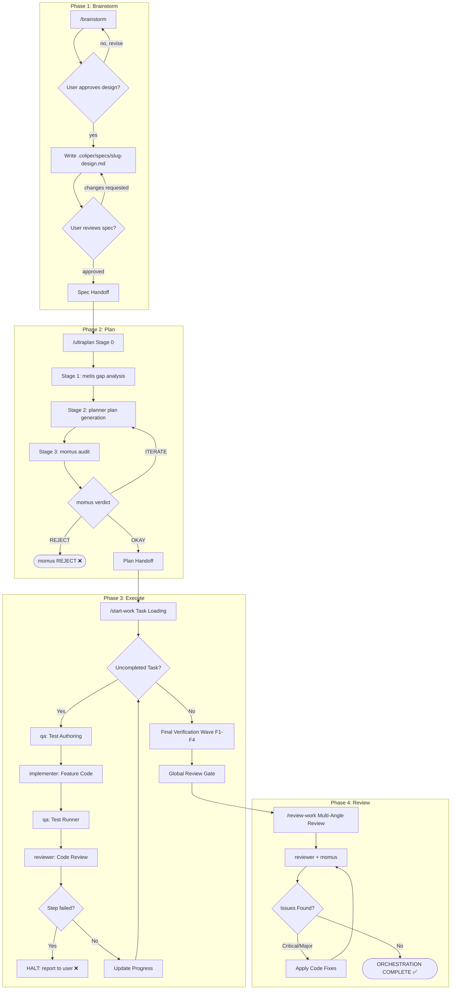

# Coliper Development Lifecycle

Coliper is an AI development harness plugin natively built for Google Antigravity (AGY). It provides structured planning, systematic debugging, test-driven development, automated code review, and strict subagent disciplines to guide AI-assisted software engineering.

The Coliper Development Lifecycle exists to enforce a structured, phase-gated workflow. By separating ideation, planning, execution, and review into distinct phases, Coliper ensures that AI-driven development remains disciplined, verifiable, and free of scope creep.

This document serves as the canonical reference for the entire workflow. It walks practitioners through the end-to-end lifecycle, detailing how phases connect, what artifacts are produced, and how specialized subagents orchestrate each step. Use this guide to understand the transitions, decision gates, and handoffs that power Coliper.

## Quick-Reference Table

| Phase | Command | Subagents | Key Artifacts |
|---|---|---|---|
| Brainstorm | `/brainstorm` | `metis` | `.coliper/specs/<slug>-design.md` |
| Plan | `/ultraplan` | `metis`, `planner`, `momus` | `.coliper/plans/<slug>.md`, `implementation_plan.md` |
| Execute | `/start-work` | `qa`, `implementer`, `reviewer`, `momus` | `.coliper/progress.md`, Evidence Logs |
| Review | `/review-work` | `reviewer`, `momus` | Code Fixes, Multi-angle Feedback |

## Complete Lifecycle Flow



## Phase 1: Brainstorm

**Purpose**: Explores user intent, requirements, and design interactively through explicit user dialogue before implementation. Turns user ideas into fully formed, approved Design Spec documents.

**Trigger**: Initiated by the user via `/brainstorm` when a new feature or significant change is requested.

**Key Steps**:
1. Explore project context (files, docs, recent commits).
2. Ask clarifying questions one at a time.
3. Propose 2–3 approaches with trade-offs and a recommendation.
4. Present design sections and iterate on user feedback.
5. Write the validated design to `.coliper/specs/<slug>-design.md`.
6. Conduct a spec self-review for placeholders, contradictions, and ambiguity.
7. Get final user review on the written spec document.
8. Hand off to `metis` and `/ultraplan`.

**Subagents Involved**:

| Subagent | Role |
|---|---|
| `metis` | Pre-planning gap analysis on the approved spec before plan drafting begins |

**Inputs**: User idea, project codebase context.

**Outputs / Artifacts Produced**: `.coliper/specs/<slug>-design.md`

**Gate Condition**: The design spec must be written to disk, self-reviewed for contradictions, and explicitly approved by the user before proceeding.

[Full SKILL reference](plugins/coliper/skills/brainstorm/SKILL.md)

---

## Phase 2: Plan

**Purpose**: Designs architectural strategies, runs multi-phase gap analysis and plan auditing, and writes decision-complete implementation plans before any code is modified.

**Trigger**: Initiated via `/ultraplan` — either directly by the user or automatically after the `/brainstorm` handoff.

**Key Steps**:
1. **Stage 0**: Resolve or autonomously generate `.coliper/specs/<slug>-design.md`.
2. **Stage 1**: Invoke `metis` to detect contradictions, ambiguity, missing constraints, and brownfield risks in the spec.
3. **Stage 2**: Invoke `planner` to draft the strategic implementation plan to `.coliper/plans/<slug>.md`.
4. **Stage 3**: Invoke `momus` to audit the plan for reference accuracy, task executability, and QA scenario concreteness. Iterate up to 2 rounds on `ITERATE` verdict; surface blockers on `REJECT`.

**Subagents Involved**:

| Subagent | Role |
|---|---|
| `metis` | Spec gap analysis — surfaces contradictions, ambiguity, missing constraints |
| `planner` | Drafts the granular, decision-complete implementation plan |
| `momus` | Deep plan audit — verifies references exist, tasks are granular, QA scenarios are executable |

**Inputs**: `.coliper/specs/<slug>-design.md`

**Outputs / Artifacts Produced**: `.coliper/plans/<slug>.md`, `implementation_plan.md` (interactive system artifact)

**Gate Condition**: `momus` must return an `OKAY` verdict on the plan. A `REJECT` verdict surfaces blocking decisions back to the user before proceeding.

[Full SKILL reference](plugins/coliper/skills/ultraplan/SKILL.md)

---

## Phase 3: Execute

**Purpose**: Executes implementation plans sequentially with durable progress tracking, test-driven development, and strict subagent orchestration. Enforces a Final Verification Wave before completion.

**Trigger**: Initiated by the user via `/start-work` after an approved plan exists at `.coliper/plans/<slug>.md`.

**Key Steps**:
1. Parse the plan file, identify uncompleted tasks (`- [ ]`), and verify prerequisite context.
2. For each uncompleted task:
   - Dispatch `qa` to write failing acceptance/integration tests (Red phase).
   - Dispatch `implementer` to write production code to make tests pass (Green phase).
   - Dispatch `qa` to run the full test suite and capture clean evidence logs.
   - Dispatch `reviewer` to perform empirical code review of modified files and evidence.
   - Mark task `- [x]` only after reviewer verification passes.
   - **If any step fails**: halt execution, log error tracebacks, and report to the user — this is a **terminal state**, not a loop.
3. Once all implementation tasks are complete, execute the **Final Verification Wave**:
   - **F1** (Plan Compliance): `reviewer` audits against all requirements and acceptance criteria.
   - **F2** (Code Quality): `reviewer` checks maintainability, edge-case safety, and freedom from AI slop.
   - **F3** (System QA): `qa` runs full project test suites and captures regression evidence.
   - **F4** (Scope Fidelity): `momus` verifies no scope creep or untracked file modifications occurred.

**Subagents Involved**:

| Subagent | Role |
|---|---|
| `qa` | Test authoring (Red phase) and test running/evidence collection |
| `implementer` | Writes production feature code to satisfy QA tests |
| `reviewer` | Empirical code review per task + F1 and F2 wave audits |
| `momus` | F4 scope fidelity audit |

**Inputs**: `.coliper/plans/<slug>.md`

**Outputs / Artifacts Produced**: Modified feature files, `.coliper/progress.md`, evidence logs in `.coliper/` or `.omo/evidence/`.

**Gate Condition**: ALL checklist items in `.coliper/plans/<slug>.md` — including Final Verification Wave tasks F1–F4 — must be empirically verified and marked `- [x]`.

[Full SKILL reference](plugins/coliper/skills/start-work/SKILL.md)

---

## Phase 4: Review

**Purpose**: Performs rigorous, multi-angle code reviews evaluating correctness, edge cases, security vulnerabilities, and performance implications before work is considered complete.

**Trigger**: Triggered automatically by the Global Review Gate at the end of `/start-work`, or manually via `/review-work` for standalone review tasks.

**Key Steps**:
1. Extract `git diff` or the list of modified/created files.
2. Delegate correctness, API contract, and logic audit to `reviewer`.
3. Delegate adversarial edge-case, boundary, and concurrency analysis to `momus`.
4. Synthesize findings into: Critical Blockers, Major Suggestions, Minor Polish.
5. Mandate concrete code fixes for all Critical and Major findings before closing.

**Subagents Involved**:

| Subagent | Role |
|---|---|
| `reviewer` | Correctness, API contracts, logic flow, and verification evidence audit |
| `momus` | Adversarial edge-case analysis — boundary conditions, concurrency, exception handling |

**Inputs**: Modified file list or `git diff`, empirical QA evidence logs.

**Outputs / Artifacts Produced**: Multi-angle feedback report; subsequent fix commits.

**Gate Condition**: All Critical and Major issues must be resolved, verified, and confirmed before the orchestrator signals `ORCHESTRATION COMPLETE`.

[Full SKILL reference](plugins/coliper/skills/review-work/SKILL.md)

---

## Phase Integration & Handoffs

The lifecycle is held together by three precise artifact handoffs:

1. **`/brainstorm` → `/ultraplan`** — The Spec Handoff
   The interactive brainstorm phase concludes by writing an approved design spec to `.coliper/specs/<slug>-design.md`. This file is the strict, immutable input constraint for `/ultraplan`. The `metis` subagent reads it as the canonical truth during gap analysis; the `planner` uses it to scope every task.

2. **`/ultraplan` → `/start-work`** — The Plan Handoff
   The planning phase finalizes a durable `.coliper/plans/<slug>.md`. This markdown blueprint hands off actionable task requirements, QA scenarios, acceptance criteria, and commit instructions to `/start-work`. Because plans are persisted to disk, execution can resume across interruptions.

3. **`/start-work` → `/review-work`** — The Global Review Gate
   Upon completing all checklist tasks and the Final Verification Wave (F1–F4), `/start-work` triggers the Global Review Gate. This passes the modified codebase and all collected QA evidence logs to `/review-work` for a final holistic inspection before work is declared complete.

---

## End-to-End Scenario

**Scenario: Adding a new `qa` subagent discipline rule to the Coliper plugin**

**Step 1 — Brainstorm**
A developer wants to enforce that QA evidence logs must always be captured at clean exit codes. They type `/brainstorm Add a new Coliper discipline rule requiring QA evidence logs to capture exit codes`.

The agent checks `plugins/coliper/rules/coliper-discipline.md` and `README.md` for context. It asks: "Should this rule apply to all subagents or only the `qa` subagent?" The developer answers: "All subagents." The agent proposes two approaches (amending rule #1 vs adding rule #7) and recommends adding a new rule. The developer agrees.

The agent writes `.coliper/specs/qa-evidence-rule-design.md` documenting the rule text, scope, and acceptance criteria. After the developer approves the spec, the agent hands off to `metis` and `/ultraplan`.

**Step 2 — Plan**
The developer types `/ultraplan`. The `metis` subagent reads the design spec and finds no gaps. The `planner` creates `.coliper/plans/qa-evidence-rule.md` with one task: append rule #7 to `coliper-discipline.md` with a markdown linter check as the QA scenario. The `momus` subagent audits the plan, confirms it is well-scoped and executable, and returns `OKAY`.

**Step 3 — Execute**
The developer types `/start-work`. The orchestrator reads `qa-evidence-rule.md`. It dispatches `qa` to write a pre-implementation verification script that checks the rule text doesn't yet exist (Red phase). It dispatches `implementer` to append the new rule to `coliper-discipline.md`. It dispatches `qa` again to run the script — it now passes. The `reviewer` confirms the change is minimal and matches the spec exactly. Progress is marked `- [x]` in `.coliper/progress.md`. The Final Verification Wave confirms no other files were touched (F4 passes).

**Step 4 — Review**
The Global Review Gate triggers `/review-work`. The `reviewer` subagent checks `coliper-discipline.md` — the new rule is clear, doesn't conflict with existing rules, and uses consistent formatting. The `momus` subagent finds no boundary issues. No Critical or Major findings are raised. The orchestrator outputs:

```
ORCHESTRATION COMPLETE
```

---

## Coliper Discipline Rules

These rules are enforced across all phases and subagents. Violations block task completion.

1. **Evidence Before Assertions** — Never claim a task or bugfix is complete without running verification commands and confirming clean output.
2. **No Masking Errors** — Do not swallow exceptions, return dummy fallback data, comment out broken assertions, or delete failing tests.
3. **Log Inspection** — Read full, un-truncated logs and tracebacks before diagnosing runtime or build failures.
4. **Codebase Respect** — Preserve existing architectural patterns, code style, and maintain concise, unbloated code.
5. **Design Spec First** — Non-trivial feature requests and architecture plans MUST start with a Design Spec written to `.coliper/specs/<slug>-design.md` (created either autonomously via `/ultraplan` or interactively via `/brainstorm`).
6. **Spec Analysis Discipline** — Before generating an implementation plan, `metis` MUST read and analyze `.coliper/specs/<slug>-design.md` using `view_file` to surface gaps, contradictions, and missing constraints.
