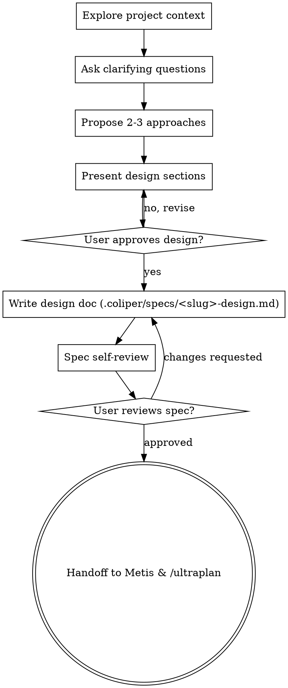

# Interactive Brainstorm Into Design Specs

Help turn user ideas into fully formed Design Specs through natural collaborative Q&A dialogue.

Start by understanding the current project context, then ask clarifying questions **one at a time** to refine the idea. Once you understand what you're building, present the design, get user approval, write the Design Spec document to `.coliper/specs/<slug>-design.md`, and hand off the spec path to `metis` and `/ultraplan`.

<HARD-GATE>
Do NOT write implementation code, scaffold code, or invoke planner/implementer until you have presented a design spec, gotten user approval, saved it to `.coliper/specs/<slug>-design.md`, and passed it through Metis gap analysis.
</HARD-GATE>

## Checklist

You MUST complete these items in order:

1. **Explore project context** — check files, docs, recent commits
2. **Ask clarifying questions** — one at a time, understand purpose/constraints/success criteria
3. **Propose 2-3 approaches** — with trade-offs and your recommendation
4. **Present design** — in sections scaled to their complexity, get user approval after each section
5. **Write design doc** — save to `.coliper/specs/<slug>-design.md` and commit
6. **Spec self-review** — quick inline check for placeholders, contradictions, ambiguity, scope
7. **User reviews written spec** — ask user to review the spec file before proceeding
8. **Handoff to Metis & `/ultraplan`** — pass the approved `.coliper/specs/<slug>-design.md` to `metis` subagent for pre-planning gap analysis, followed by `/ultraplan` plan generation.

## Process Flow

**The terminal state is handing off `.coliper/specs/<slug>-design.md` to `metis` and `/ultraplan`.**

## The Process

**Understanding the idea:**
- Check out the current project state first (files, docs, recent commits).
- Ask questions one at a time to refine the idea.
- Prefer multiple choice questions when possible, but open-ended is fine too.
- Only one question per message - if a topic needs more exploration, break it into multiple questions.

**Exploring approaches:**
- Propose 2-3 different approaches with trade-offs.
- Present options conversationally with your recommendation and reasoning.

**Presenting the design & Writing Spec:**
- Once approved, write the validated design to `.coliper/specs/<slug>-design.md`.
- Run a self-review scan for placeholders, contradictions, and ambiguity.
- Get final user approval on the written spec document.

**Handoff to Metis & `/ultraplan`:**
- Call `metis` subagent (`view_file`) on `.coliper/specs/<slug>-design.md` to perform pre-planning gap analysis.
- Proceed to `/ultraplan` to generate the `.coliper/plans/<slug>.md` implementation plan.
